<p align="center">
  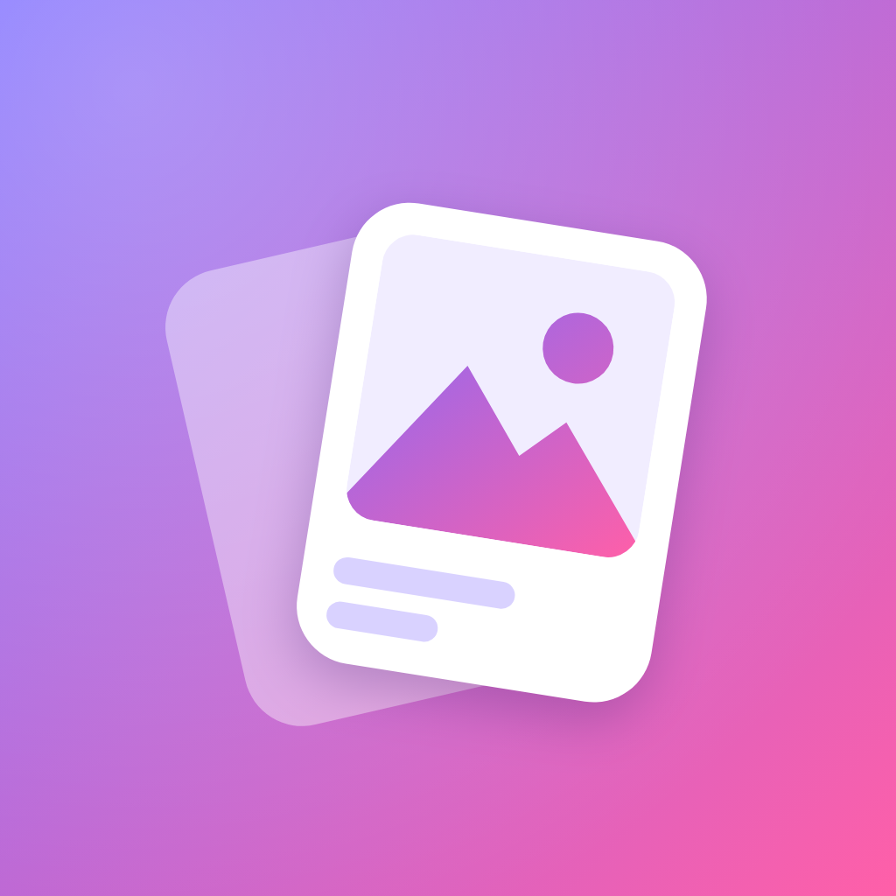
</p>

<h1 align="center">GalleryShift</h1>

<p align="center">
  <b>Swipe your gallery clean.</b><br />
  Go through your photos and videos one at a time: swipe right to keep, left to delete.<br />
  Nothing is removed until you review the bin and confirm.
</p>

<p align="center">
  
  
  
</p>

<p align="center">
  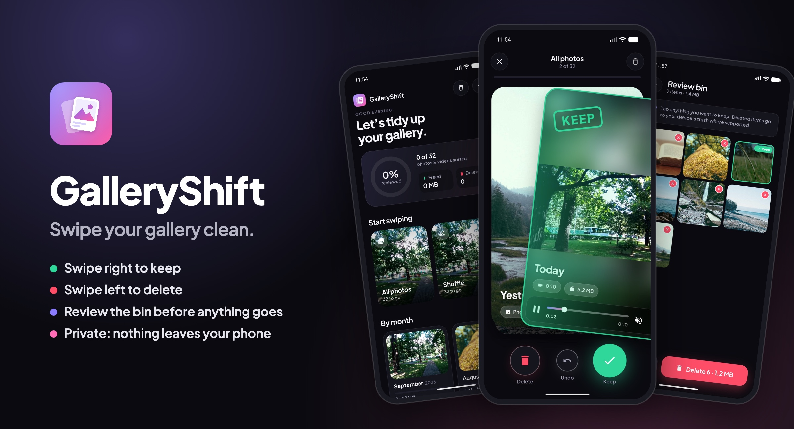
</p>

## Screenshots

| Welcome | Home | Swipe to keep |
| :---: | :---: | :---: |
| 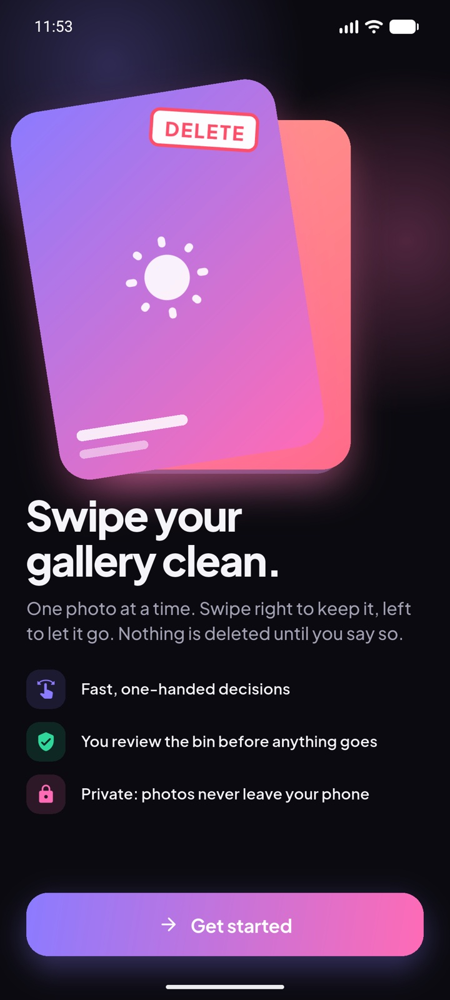 | 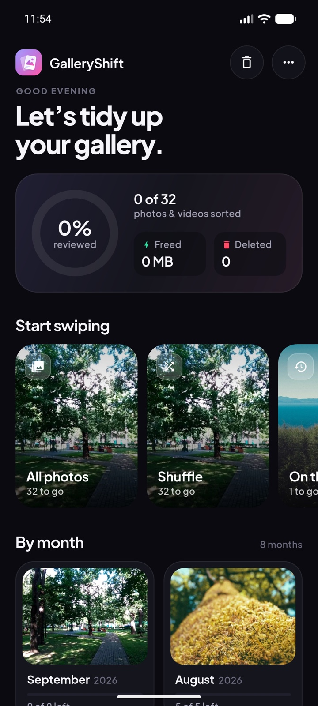 | 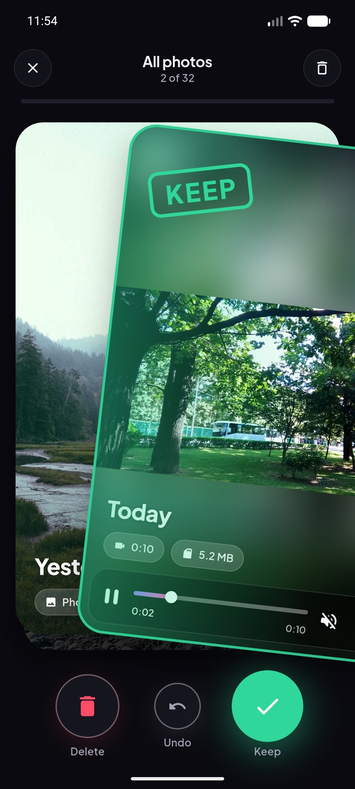 |
| **Swipe to delete** | **Videos play on the card** | **Photo card** |
| 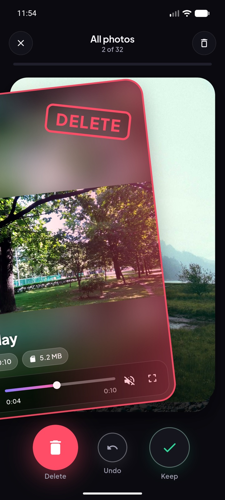 | 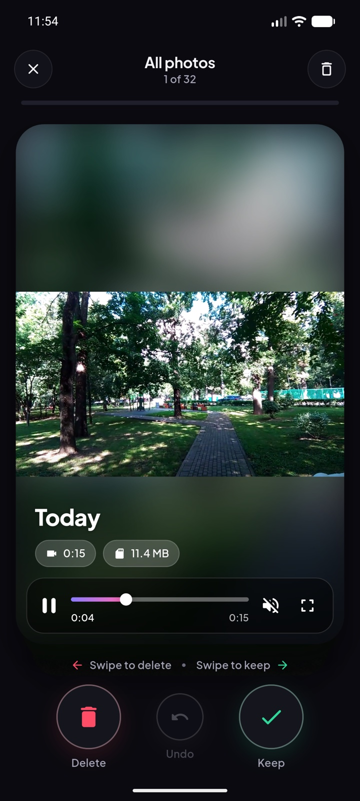 | 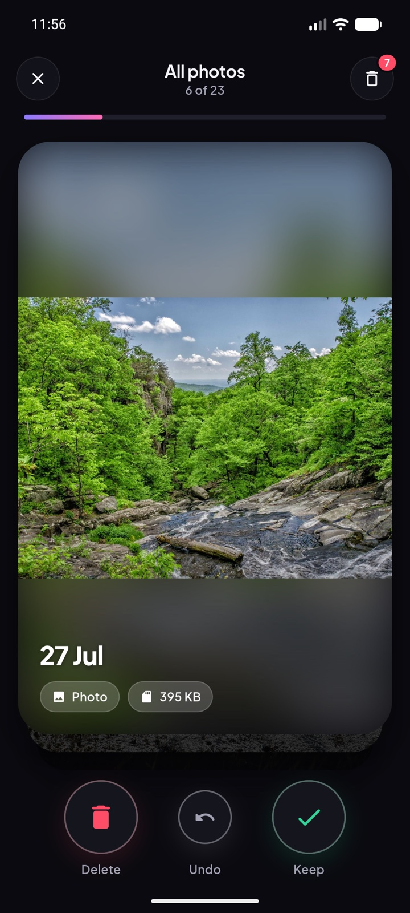 |
| **Review bin** | **Space freed** | **Light mode** |
| 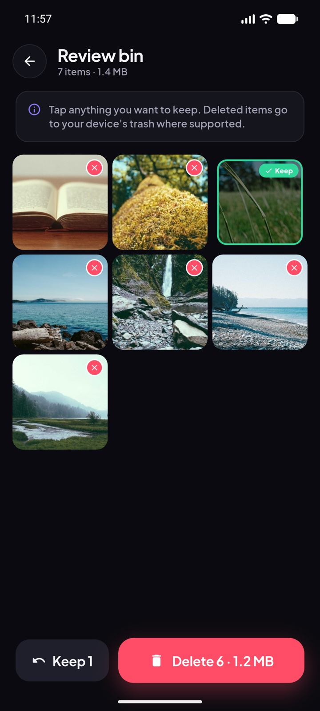 | 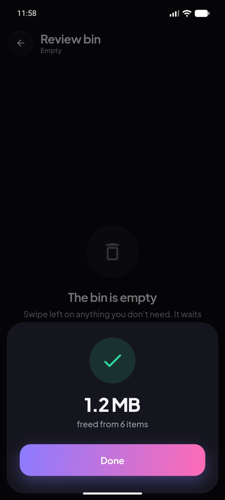 | 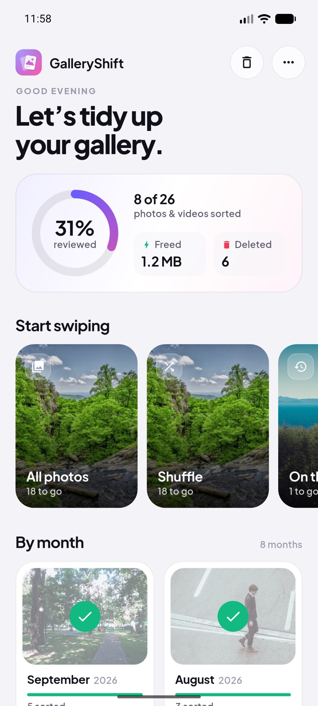 |

## Features

- **Tinder-style decks.** Cards follow your finger and tilt with the drag. A KEEP or DELETE stamp appears, and the phone vibrates when you cross the decision point. A quick flick counts too, and Undo brings the last card back.
- **Decks that make sense.** All photos (newest first), Shuffle, On this day, Screenshots, Videos, and one deck per month with its own progress.
- **Videos play on the card.** They autoplay muted, and the next video preloads. Controls: a seek bar, double-tap either side to jump ±10 s, and long-press for 4× speed. A full-screen player continues from the same spot.
- **A safety net.** Swiping left only moves an item to the review bin. In the bin, tap anything to rescue it, then delete the rest in one go. Deleted items go to *Recently Deleted* on iOS, or the system trash on Android 11+, for 30 days.
- **Storage cleanup (Android).** Scans shared storage for:
  - **Junk:** leftovers from Android's trash (hidden `.trashed-…` files that still use space), APK installers, temp and log files, half-finished downloads, and thumbnail caches.
  - **Empty folders.**
  - **Large files** over 50 MB, biggest first.
  - **Documents** (PDF, Office, text, ebooks). Tap one to open it in another app and review it.

  **Clean junk** clears junk and empty folders in one go. Large files and documents are picked one by one. These deletions are permanent, and the confirmation says so.
- **Progress you can see.** The home screen shows how much of the library you've reviewed, space freed and items deleted, and remembers where you left off.
- **Private by design.** Photos never leave the device. The app makes no network requests, has no analytics and needs no account. The only links, to the developer's profiles on the About screen, open in your browser.
- **Polished details.** Follows the system light or dark mode, uses the bundled Plus Jakarta Sans font, and has haptics throughout.

## Getting started

Requirements: Flutter 3.47+ (Dart 3.13+), Xcode for iOS, and the Android SDK for Android.

```bash
flutter pub get
flutter run                # on a connected phone or simulator
flutter build apk --release
flutter build ios --release
```

The app needs access to the photo library:

| Platform | What it asks for |
| --- | --- |
| iOS | Photo library read/write (`NSPhotoLibraryUsageDescription`). Limited access works; the home screen offers **Add more**. |
| Android 13+ | `READ_MEDIA_IMAGES`, `READ_MEDIA_VIDEO`, `READ_MEDIA_VISUAL_USER_SELECTED` |
| Android ≤ 12 | `READ_EXTERNAL_STORAGE` (and `WRITE_EXTERNAL_STORAGE` on ≤ 10) |
| Android 11+, storage cleanup only | `MANAGE_EXTERNAL_STORAGE` ("All files access"), asked for only when you open Storage cleanup |

Storage cleanup is Android-only. iOS gives apps no access to files outside their own sandbox and the photo library.

It never looks inside `Android/` (other apps' private data, which Android 11+ blocks anyway), and it never deletes the standard folders (DCIM, Download, Music, …) or system marker files such as `.nomedia`.

> **Play Store note:** Google Play only allows `MANAGE_EXTERNAL_STORAGE` for certain app types (file managers, backup, antivirus, document management) and asks you to justify it. A gallery cleaner may be refused. If that happens, ship the Play build without storage cleanup; sideloaded APKs are unaffected.

> **Simulator note:** on iOS 26 simulators, `xcrun simctl privacy … grant photos` does not satisfy PhotoKit. Tap **Allow Full Access** in the system dialog instead. Android emulators accept `adb shell pm grant`.

## How it works

```
lib/
├── main.dart, app.dart          app setup, theme, and which screen to show first
├── data/
│   ├── gallery_repository.dart  photo_manager wrapper: permission, loading, sizes, delete/trash
│   ├── decision_store.dart      keep/delete decisions and stats in shared_preferences
│   └── storage_scanner.dart     junk / empty-folder / large-file / document scan and delete (isolate)
├── state/
│   ├── app_controller.dart      library, decks, bin, and stats (ChangeNotifier)
│   └── storage_cleaner.dart     all-files access, scan state, deletion
├── ui/
│   ├── screens/                 onboarding, home, swipe, review bin, viewer, storage cleanup
│   └── widgets/
│       ├── swipe_deck.dart      card physics, stamps, fling, spring-back, undo
│       ├── asset_card.dart      photo/video card with date, type and size
│       └── video_view.dart      inline and full-screen video player, seek bar, gestures
└── theme/app_theme.dart         colours, type scale, motion
```

- **Deletion is batched.** Decisions are stored locally. Nothing touches the library until you tap **Delete** in the bin. Then Android 11+ uses `MediaStore` trash, and iOS uses `PHAssetChangeRequest` deletion. Both show the system's own confirmation.
- **The library is sorted in Dart by capture date.** On Android, the platform order follows when files were added to the device, which scrambles copied or restored galleries.
- **Cards keep their state as they move up the stack.** Every card has the same widget structure at every depth, so a preloaded video isn't thrown away when its card reaches the front. A test covers this.

## Development

```bash
flutter analyze
flutter test
```

The app icon and the showcase banner are drawn in Dart, so no design tools are needed:

```bash
flutter test tool/generate_icon_test.dart && dart run flutter_launcher_icons  # app icons
flutter test tool/showcase_test.dart                                          # docs/showcase.png
```

`tool/showcase_test.dart` writes a PNG. The README uses a JPEG copy; convert it with `sips -s format jpeg docs/showcase.png --out docs/showcase.jpg`.

Screenshots were taken on an Android emulator filled with sample images from [Lorem Picsum](https://picsum.photos) and sample videos from [samplelib](https://samplelib.com).

## Developer

Designed and developed by **Zaman Sheikh**.

- GitHub: [github.com/zamansheikh](https://github.com/zamansheikh)
- Facebook: [fb.com/zamansheikh.404](https://fb.com/zamansheikh.404)

## Built with

[Flutter](https://flutter.dev) · [photo_manager](https://pub.dev/packages/photo_manager) · [video_player](https://pub.dev/packages/video_player) · [shared_preferences](https://pub.dev/packages/shared_preferences) · [Plus Jakarta Sans](https://fonts.google.com/specimen/Plus+Jakarta+Sans) (OFL)
